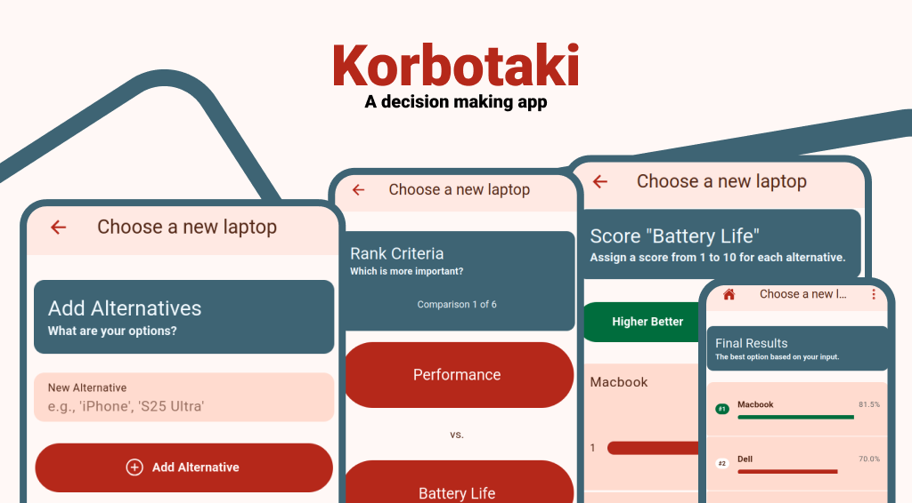

# Korbotaki : A decision making app




Sometimes, we are presented with choices and cannot decide on the best one. By applying a decision matrix, this app provides you with the most viable alternatives.


## How do I use this thing?

1. Create a new decision by tapping the ```+``` button in the homepage. Add a title for your decision, e.g. Choose a new plant. 

2. Add alternatives ie. list of you all possible options. For example, if you are deciding buying a new plant to _plant_, your alternatives might be Rose, Aloe vera etc.

3. Define criteria by which you'll evaluate the alternatives. You can add custom ones or add from some common suggestion like 'Cost', 'Benefit' or 'Satisfaction'. Be sure to specify whether the criterion's higher score is better or lower score is better,. For example, lower 'Cost' is generally better, so you'd select Lower is Better for 'Cost'.

4. Rank criteria on the basis of which is more important to you. For example, 'Aesthetic gratification' might be more important to you than 'Cost'. So rank accordingly. 

5. Score the alternatives on each criterion.

6. View the results.


Please note that the results are not unbiased from your own biasness, as the ranking of criteria and scoring of each alternatives are entirely up to you.


## Made with

Framework: Ionic with Vue 

State Management: Pinia

Routing: Vue Router

Language: TypeScript

Internationalization: Vue I18n

## Contributing

### Prerequisites

1. Node.js (LTS version recommended)

2. Ionic CLI (npm install -g @ionic/cli)

### Installation & Setup

Clone the repository:

```
git clone <your-repository-url>
cd <project-directory>
```

Install dependencies:

``` 
npm install 
```

Run the development server:
```
npm run dev
```

Build for production:

```
npm run build
```

Build for android

```
cd android
./gradlew assembleDebug
```